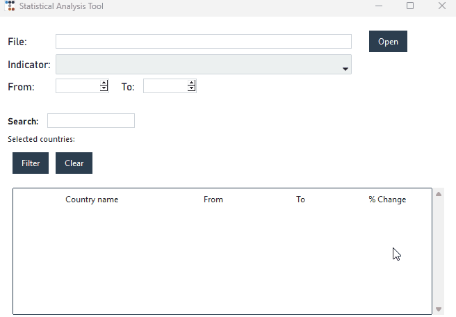

# Statistical Analysis Tool

A lightweight desktop application for exploring and analyzing economic and statistical indicators across countries.
Users can load CSV datasets, select indicators (like GDP, CPI, or other metrics), choose year ranges, and filter by country. The app automatically calculates percentage changes over time, supports sorting, and provides an interactive, easy-to-use interface for quickly visualizing trends and changes.

## Table of Contents

- [Features](#features)
- [Installation](#installation)
- [Usage](#usage)
- [Technologies Used](#technologies-used)
- [Architecture](#architecture)
- [Learning Outcomes](#learning-outcomes)


<br>
<br>
<div align="center">
  
</div>

## Features

- **CSV Data Import**: Load and validate statistical data from CSV files
- **Indicator Selection**: Choose from multiple indicators in your dataset
- **Year Range Analysis**: Calculate percentage changes between any two years
- **Country Filtering**: Search and filter results by specific countries
- **Interactive Sorting**: Click column headers to sort data ascending/descending
- **User-Friendly Interface**: Clean desktop GUI with intuitive controls

## Installation

### Prerequisites
- Python 3.8 or higher
- pip (Python package manager)

### Steps

1. **Clone the repository**
   ```bash
   git clone https://github.com/username/Statistical-Analysis-Tool.git
   cd Statistical-Analysis-Tool
   ```

2. **Install dependencies**
   ```bash
   pip install -r requirements.txt
   ```


## Usage

### Running the Application

```bash
python src/main.py
```

### Using the Application

> **Tip:** Sample data is available in `data/sample_data.csv` for testing purposes.

1. **Load Data**
   - Click the "Open" button to browse and select a CSV file
   - The file path will appear in the File field

2. **Select an Indicator**
   - Use the "Indicator" dropdown to choose which indicator to analyze

3. **Choose Year Range**
   - Set the "From" and "To" years using the spinbox controls
   - Press Enter to update the results

4. **Filter by Country**
   - Use the "Search" bar to find countries by name
   - Double-click a country row to add it to the selection
   - Click "Filter" to apply the selection
   - Click "Clear" to reset and show all countries

5. **Sort Results**
   - Click any column header to sort by that column
   - Click again to reverse the sort order

### CSV File Format

Your CSV file must follow this structure:

| COUNTRY | INDICATOR | 1999 | 2000 | 2001 | ...  | 2020 |
|---------|-----------|------|------|------|------|------|
| USA     | GDP       | 2800 | 5800 | 9900 | 15000| 20900|
| Canada  | CPI       | 250  | 580  | 730  | 1700 | 1900 |

**Requirements:**
- First column must be named `COUNTRY`
- Second column must be named `INDICATOR`
- Remaining columns must be year headers (format: YYYY, between 1900-2099)
- The headers must be in strictly increasing order without gaps between years
- Country and Indicator columns must contain text
- Year columns must contain numeric values

## Technologies Used

- **Python 3** - Core programming language
- **Pandas** - Data manipulation and analysis
- **Tkinter** - Desktop GUI framework
- **Regular Expressions (re)** - Data validation
- **OS module** - File system operations

## Architecture

This application follows the **Model-View-Controller (MVC)** architectural pattern:

### Model (`data_handler.py`)
Responsible for data management and business logic:
- Loading and validating CSV files
- Storing data in pandas DataFrames
- Calculating delta (percentage change) values

### View (`gui.py`)
Handles the user interface:
- Building GUI components (buttons, dropdowns, table)
- Displaying data in the treeview widget
- Rendering search bar and filters
- Managing visual feedback and error messages

### Controller (`controller.py`)
Coordinates between View and Model:
- Handling user interactions (button clicks, selections)
- Validating user inputs
- Requesting data from the Model
- Updating the View with results


## Learning Outcomes

This project demonstrates:
- Object-oriented programming principles
- Design pattern implementation (MVC)
- Data manipulation with Pandas
- File I/O and data validation
- Event-driven programming
- GUI development with Tkinter


